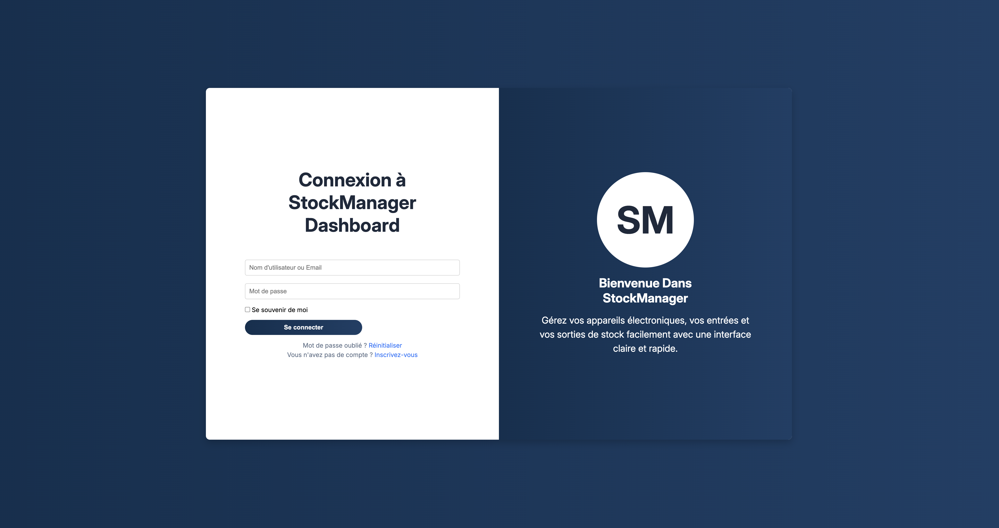
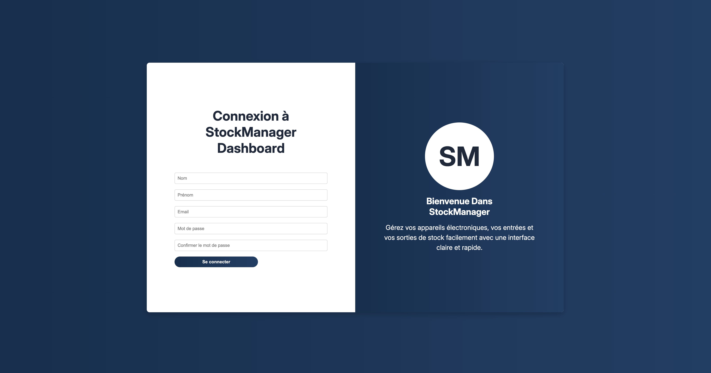
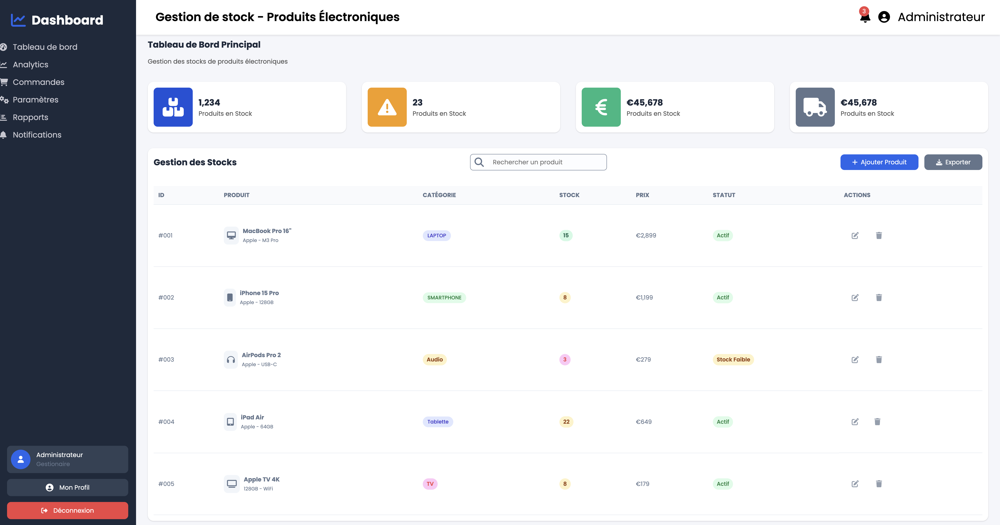
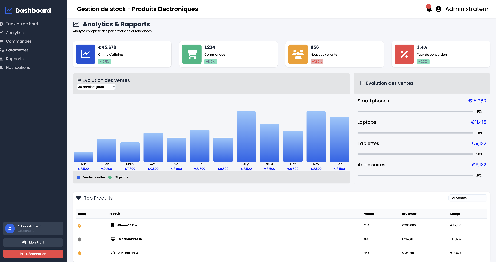
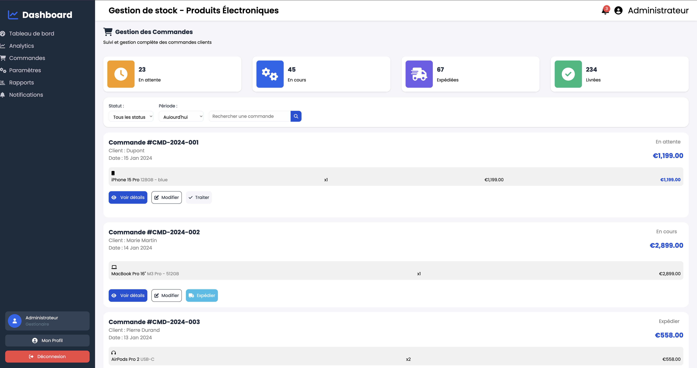
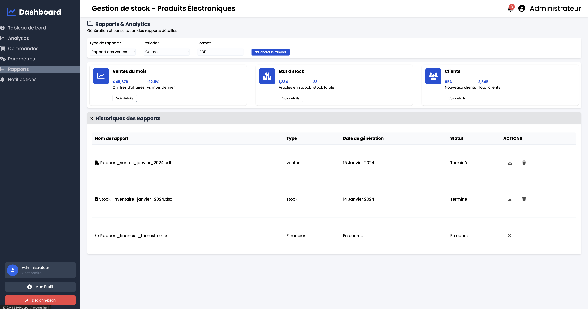
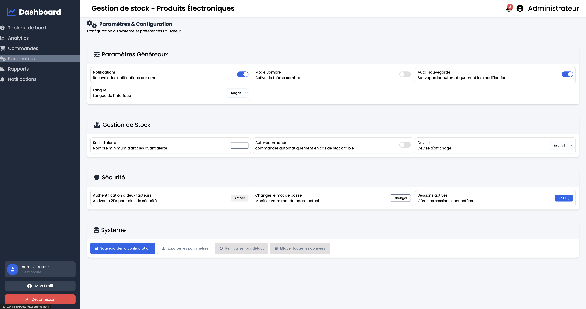
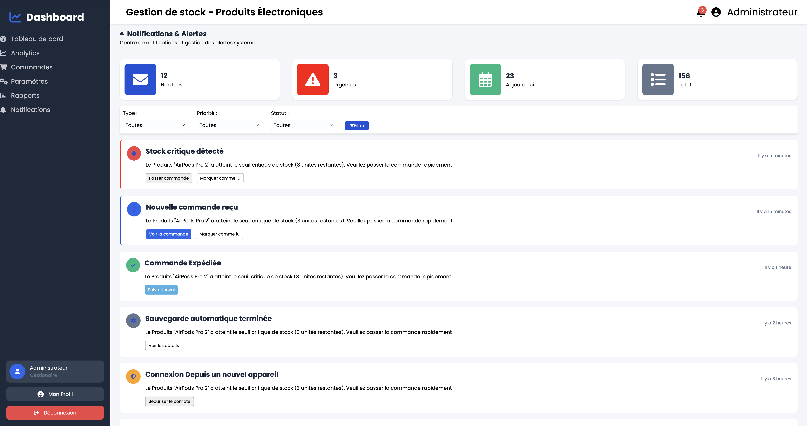

# 📊 Dashboard de Ventes -- Produits Électroniques

Ce projet est un **dashboard responsive réalisé uniquement en HTML et
CSS**, visant à présenter les performances de ventes de produits
électroniques. Il s'agit d'une interface moderne, propre et intuitive,
conçue pour un usage pédagogique et pour renforcer mes compétences en
intégration web.

## 🚀 Objectifs du Projet

- Créer une interface de type **dashboard professionnel**.\
- Structurer les sections avec un **layout cohérent et responsive**.\
- Utiliser efficacement **CSS Grid**, **Flexbox**, et les variables
    CSS.\
- Reproduire les éléments courants d'un tableau de bord :
- Cartes de statistiques\
- Graphiques simplifiés\
- Menu latéral\
- Tableau des ventes

## 🛠️ Technologies Utilisées

- **HTML5** -- Structure sémantique\
- **CSS3** -- Mise en page, animations, responsivité\
- **Flexbox & Grid Layout** -- Organisation des sections\
- **Variables CSS** -- Gestion des couleurs et typographies\
- **Google Fonts / Icônes** -- Design moderne

Aucun framework (Bootstrap, Tailwind) n'a été utilisé.

## 📐 Fonctionnalités du Dashboard

- Interface dashboard en pleine largeur
- Sidebar fixe avec navigation
- Cartes statistiques (CA, ventes, visiteurs...)
- Section graphique imitant un chart
- Tableau des dernières ventes
- Header avec actions (recherche, notifications, profil)
- Version mobile et tablette optimisée

## 📱 Responsivité

Le design est adapté pour :

- **Tablettes** (768px)

Grâce à un systeme de grid fluide et des breakpoints ciblés.

## 🔧 Aperçu

## 🌟 Améliorations Possibles

- Ajouter des graphiques dynamiques (Chart.js)
- Intégrer une vraie base de données
- Ajouter un thème clair / sombre
- Ajouter un système d'authentification
- Transformer le projet en SPA (React, Vue, etc.)

## 📄 Licence

Projet réalisé dans un but éducatif. Gratui d'utilisation.
